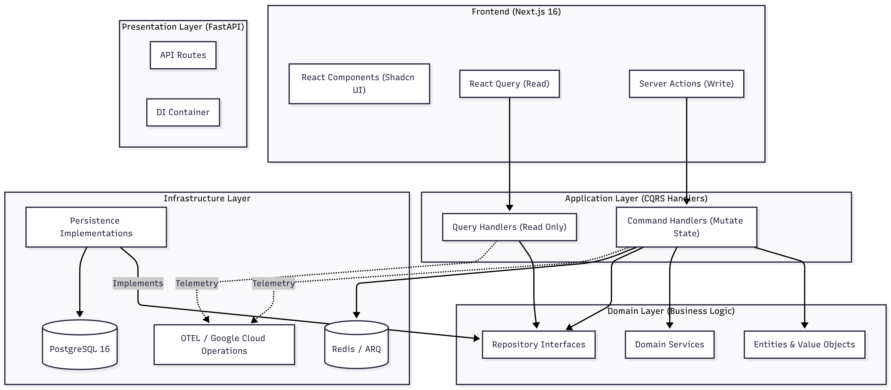
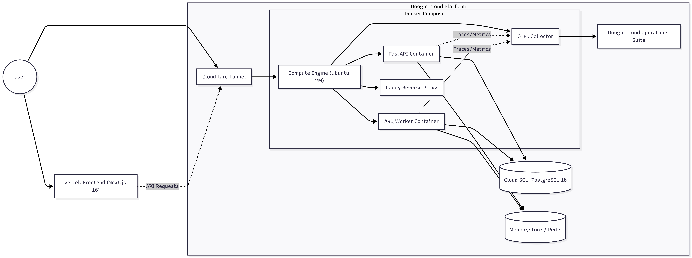
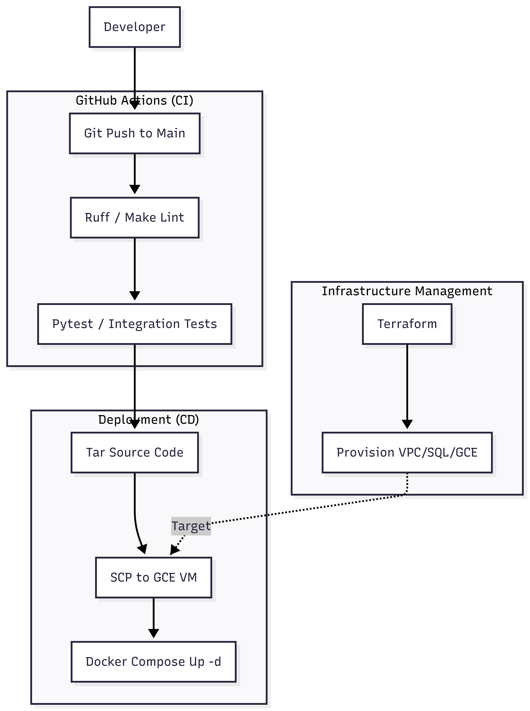
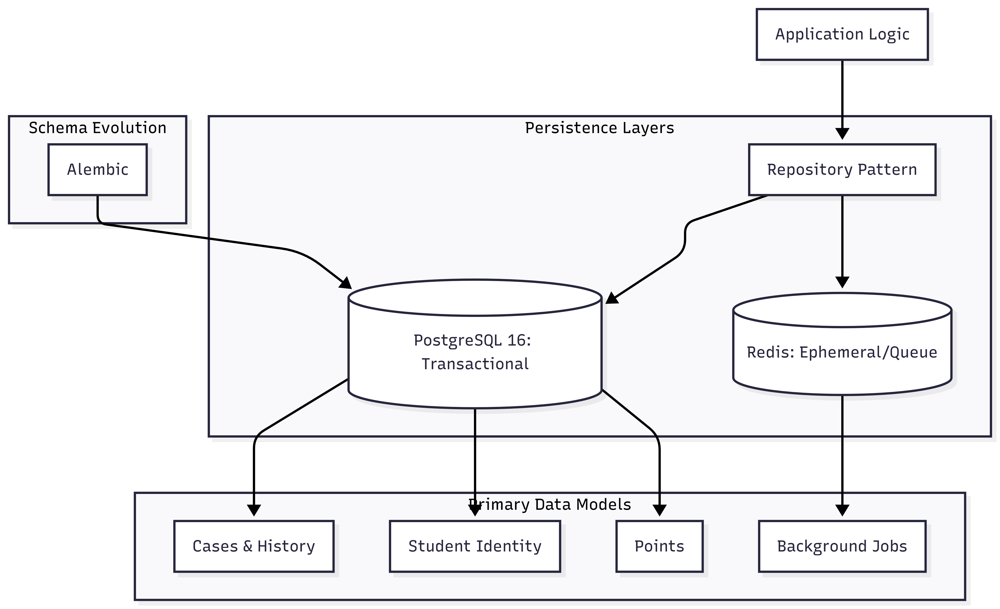

# System Architecture: The Activation Engine (v2.0)

## 1. Executive Summary
The Activation Engine is a proactive intervention platform designed to bridge the gap between student academic performance and advisor engagement. It leverages AI-driven "Empathy Nudges" and a gamified performance engine to shift university interventions from passive monitoring to active coaching.

---

## 2. Application Architecture: DDD & CQRS
The system is built on a **DDD-inspired Hexagonal (Clean) Architecture**. This ensures that the core business logic (The Domain) is decoupled from external frameworks, databases, and UI concerns.

### Core Architectural Patterns

#### A. Domain-Driven Design (DDD)
The "Heart" of the system is the **Domain Layer**, which remains pure and agnostic of the outside world.
*   **Entities**: Objects with identity and lifecycle (e.g., `Case`, `Student`, `Advisor`).
*   **Value Objects**: Immutable attributes that define domain concepts (e.g., `ImpactScore`, `Status`).
*   **Domain Services**: Logic that doesn't naturally fit into a single entity (e.g., `GamificationService`, `AnomalyEngine`).
*   **Repository Interfaces**: "Ports" that define how the domain expects data to be persisted, implemented later by the Infrastructure layer.

#### B. Command Query Responsibility Segregation (CQRS)
To ensure scalability and maintainability, we strictly separate "Write" operations from "Read" operations.
*   **Commands (Writes)**: Encapsulate intent to change state (e.g., `ApproveNudgeCommand`). They are handled by specific handlers that enforce domain invariants.
*   **Queries (Reads)**: Optimized for data retrieval (e.g., `GetLeaderboardQuery`). They bypass complex domain logic to provide high-performance data transfer objects (DTOs) directly to the UI.

### Component Diagram

---

## 3. Deployment Architecture
The application uses a hybrid deployment model: the frontend is optimized for edge delivery on **Vercel**, while the backend and background workers are hosted on **Google Cloud Platform (GCP)**.

### Deployment Diagram

---

## 4. DevOps Architecture
The DevOps lifecycle is automated using **GitHub Actions** for CI and **Terraform** for Infrastructure as Code (IaC). Deployment is managed via a secure SSH/SCP pipeline to GCE.

### DevOps Pipeline

---

## 5. Data Architecture
The system employs a centralized persistence strategy using PostgreSQL for transactional integrity and Redis for high-performance task orchestration.

### Data Flow Diagram

---

## 6. Key Technical Stack
*   **Frontend**: Next.js 16, Tailwind CSS, Shadcn UI.
*   **Backend**: Python 3.12, FastAPI.
*   **Database**: PostgreSQL 16 (Managed via Cloud SQL).
*   **Task Queue**: ARQ (Redis-backed).
*   **Infrastructure**: GCP (Compute Engine, VPC, Cloud SQL), Vercel.
*   **IaC**: Terraform.
*   **Observability**: OpenTelemetry, Google Cloud Operations Suite (Cloud Trace, Monitoring, Logging), Prometheus, Jaeger.
